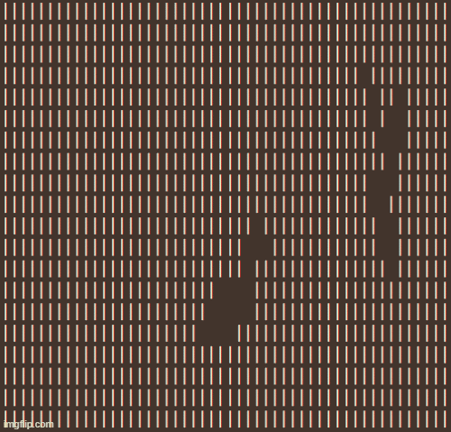

# Fight the Sun!
## Procedural Dungeon Generation With Random Walk
Here, we are working with a flat-top hexagonal grid, which Unity defines using "odd-r" offset coordinates.

```Hexagons.cs``` contains ```Hexagons``` class that implements common formulas and algorithms on hexagonal grids:

Implementation details were sourced largely from [Hexagonal Grids from Red Blob Games](https://www.redblobgames.com/grids/hexagons/). This goated resource contains everything ever about hexagonal grids.

We start out with a ```WIDTH * HEIGHT``` map of all walls. Each random walk carves out a new path out of these walls. 

For ```walks``` iterations, we start from a random seed and grow a path of maximum length ```maxLength``` by randomly recursively choosing one of the 6-adjacent hexagonal neighbors to advance to.

## Connecting Disjoint Path Segments
A newly generated path could be completely isolated from the existing dungeon map ```dungeon```. 
In the case that the path ```path``` returned by ```Walk``` is disconected, a linear path is drawn connecting the starting seed ```(x, y)``` of ```path``` to some random point ```(x_link, y_link)``` in the main ```dungeon``` map. 

This is achieved by hexagonal linear interpolation, where given ```N``` is the Manhattan distance between ```(x, y)``` and ```(x_link, y_link)```, we sample ```N+1``` equally spaced points along the ray ```(x, y) + (x_link - x, y_link - y) * t```. The sampled points are then rounded to valid hexagonal odd-r offset coordinates and used to build a connecting path between the disjoint islands.



## Random Walk with Re-Weighted Directions
At the start of a walk, we weight all 6 possible next directions equally and sample uniformly at random. Let the next direction to move to be ```(dx, dy)```. Then, let the weights for sampling directions in the next iteration $t-1$ of walk be re-computed as follows:
1) With ```Hexagons.cube_distance```, compute the hexagonal Manhattan distance ```dist[i]``` in Cube coordinates between each possible direction in ```directions``` and the sampled next direction ```(dx, dy)```.
2) New weights $w_{t+1}[i]$ are proportional to $e^{-\alpha(dist[i])}$. Specifically we compute $w_{t+1}[i] \leftarrow w_{t}[i] * e^{-\alpha(dist[i])}$, and normalize such that all the recomputed weights sum to 1.

We define hyperparameter $\alpha$ to toggle how much we want the current sampled direction to influence the sampling of the next direction. Let us consider two of the extremes for setting $\alpha$:
1) If $\alpha = 0$, then $e^{-\alpha(dist[i])} = 1$ for all $i \in [0, 6)$. This means that the weights for directions will always be $\frac{1}{6}$ and we will be sampling uniformly at random for each iteration, independent of the past directions. Setting $\alpha = 0$ is good for high entropy dungeons, such as random caves and winding tunnels.
2) If $\alpha = \infty$, then $e^{-\alpha(dist[i])} = 1$ if and only if $dist[i] = 0$, else $e^{-\alpha(dist[i])} = 0$. This enforces that the next direction will be the same as the current direction, and the resulting path will be essentially a straight line in the initially sampled direction.  

## Game Inspirations
[Into Ruin](https://www.lexaloffle.com/bbs/?tid=49928)

[SCHiM](https://schimgame.com/)

## Important Links
[Hexagonal Grids from Red Blob Games](https://www.redblobgames.com/grids/hexagons)

[Procedural Dungeon Generation: An In-Depth Guide to Random Walk Algorithms](https://thelinuxcode.com/procedural-dungeon-generation-an-in-depth-guide-to-random-walk-algorithms/)

[Procedural Generation with Wave Function Collapse](https://www.gridbugs.org/wave-function-collapse/)

[The Wave Function Collapse Algorithm](https://pyprogramming.org/the-wave-function-collapse-algorithm/)

[Amit's Game Programming Information](http://www-cs-students.stanford.edu/~amitp/gameprog.html)

[Algorithms to Connect Rooms](https://www.reddit.com/r/roguelikedev/comments/uqv5u6/algorithms_to_connect_rooms/)

[Cellular Automata Method for Generating Random Cave-Like Levels](https://chizaruu.github.io/roguebasin/cellular_automata_method_for_generating_random_cave-like_levels)

[Generating Worlds With Wave Function Collapse](https://procjam.com/tutorials/wfc/)
